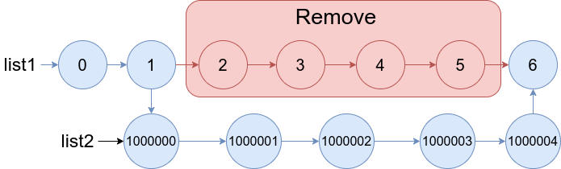

# 1669. Merge In Between Linked Lists

You are given two linked lists: **list1** and **list2** of sizes **n** and **m** respectively.

Remove **list1**'s nodes from the **a^th^** node to the **b^th^** node, and put **list2** in their place.

The blue edges and nodes in the following figure indicate the result:

Build the result list and return its head.

 

### Example 1:

Input: list1 = [10,1,13,6,9,5], a = 3, b = 4, list2 = [1000000,1000001,1000002]
Output: [10,1,13,1000000,1000001,1000002,5]
Explanation: We remove the nodes 3 and 4 and put the entire list2 in their place. The blue edges and nodes in the above figure indicate the result.

### Example 2:

Input: list1 = [0,1,2,3,4,5,6], a = 2, b = 5, list2 = [1000000,1000001,1000002,1000003,1000004]
Output: [0,1,1000000,1000001,1000002,1000003,1000004,6]
Explanation: The blue edges and nodes in the above figure indicate the result.
 
### Constraints:
- 3 <= list1.length <= 104
- 1 <= a <= b < list1.length - 1
- 1 <= list2.length <= 104
